# 統計モデリングの教科書: 線形回帰モデル
# データ解析のための統計モデリング \#2 理論編 (2)

```matlab:Code
clear;
close all;
load tbl.mat;
```

## 2. モデルの選択法は？
  

A :

「線形回帰って直線だけなんですか？表計算ソフトだと2次関数で近似とかできましたけど」

「MATLAB は曲線近似できないんですか？」


B:

「(これはマズイ感じが...) 2次関数の近似も線形回帰ですよ！」

「ところで線形回帰の定義は分かりますか？パラメータに関して線形という事がポイントです。つまり：

$$
y=X{\beta }+{\epsilon }
$$

と表現できれば、実は線形回帰なんですよ！

極端な例だと、

$$
y=\beta_0 +\beta_1 \log (x)+\beta_2 x^2 +\beta_3 \sin x
$$

も線形回帰です」


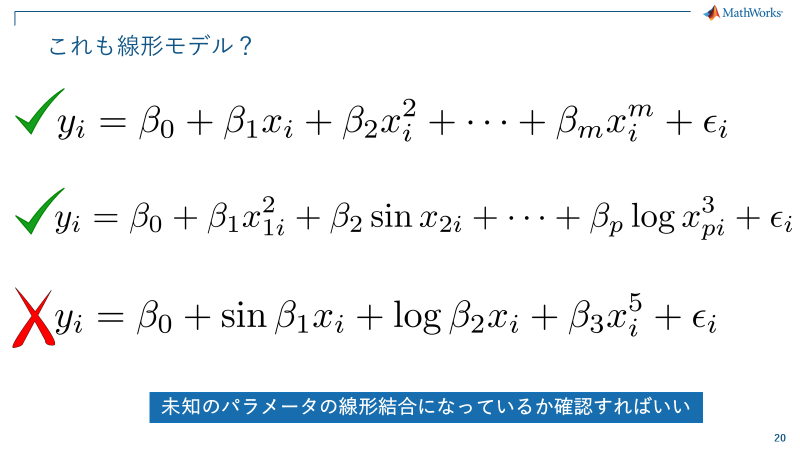

A:

 「なるほど。先ほどのモデルは1次関数だったじゃないですか？モデルをもっとフィットさせるために次数を増やそうと思います」

「まずは、先ほどの1次関数」

```matlab:Code
linear_mdl_1 = fitlm(tbl,"MPG~1+Weight");
disp(linear_mdl_1);
```

```text:Output
線形回帰モデル: 
    MPG ~ 1 + Weight

推定された係数: 
                    Estimate         SE         tStat       pValue  
                   __________    __________    _______    __________
    (Intercept)        49.238        1.6504     29.834    9.0258e-49
    Weight         -0.0086118    0.00053775    -16.014    3.2405e-28

観測数: 93、誤差の自由度: 91
平方根平均二乗誤差: 4.16
決定係数: 0.738、自由度調整済み決定係数: 0.735
F 統計量 - 定数モデルとの比較: 256、p 値は 3.24e-28 です
```

```matlab:Code
plot(linear_mdl_1);
```


A :

「3次の項まで増やしちゃおう....おっ! これはよさそうだぞ！」

```matlab:Code
linear_mdl_2 = fitlm(tbl,"MPG~1+Weight^3");%fitlm(tbl,"MPG~1+Weight+Weight^2+Weight^3");
disp(linear_mdl_2);
```

```text:Output
線形回帰モデル: 
    MPG ~ 1 + Weight + Weight^2 + Weight^3

推定された係数: 
                    Estimate         SE         tStat     pValue 
                   __________    __________    _______    _______
    (Intercept)        24.278        28.374    0.85563     0.3945
    Weight            0.02036      0.028588     0.7122     0.4782
    Weight^2       -1.061e-05    9.2644e-06    -1.1452    0.25519
    Weight^3       1.2224e-09    9.6777e-10     1.2631    0.20984

観測数: 93、誤差の自由度: 89
平方根平均二乗誤差: 4.12
決定係数: 0.748、自由度調整済み決定係数: 0.74
F 統計量 - 定数モデルとの比較: 88.3、p 値は 1.4e-26 です
```

```matlab:Code
plot(linear_mdl_2);
```

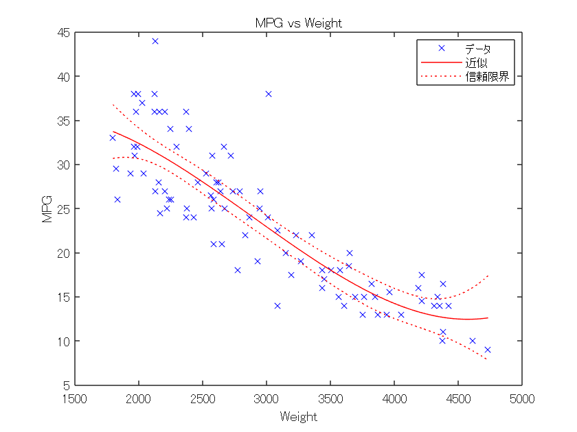

B: 

「ウィルキンソンの表記が複雑になってきたので、再度まとめます」


B:

「Aさん、モデルとしてはどちらが優れていますか？またどうしてそう考えたか教えてください」

A:

 「決定係数も…3次の方がよさそうだな。項をどんどん上げていった方が良いのかな？うーん....」

決定係数

```matlab:Code
linear_mdl_1.Rsquared
```

```text:Output
ans = 
    Ordinary: 0.7381
    Adjusted: 0.7352
```

```matlab:Code
linear_mdl_2.Rsquared
```

```text:Output
ans = 
    Ordinary: 0.7485
    Adjusted: 0.7400
```

A:

「3次の項まで使っているモデルの方がフィッティング  (決定係数) が良いので、こちらの方が良いモデルです！(ドヤっ) 」

「それにしても、Ordinary と Adjusted って何だろう....」

### 問題2.1：何を見落としているか？
  

B :

「決定係数の定義って覚えていますか？」

A:

 「もちろん、モデルが説明できる量の事です。(ドヤ2) 」

$$
R^2 =\frac{\sum ({\hat{y} }_i -\bar{y} )^2 }{\sum (y_i -\bar{y} )^2 }=1-\frac{\sum (y_i -{\hat{y} }_i )^2 }{\sum (y_i -\bar{y} )^2 }=1-\frac{\textrm{予測値による変動}}{\textrm{総変動}}
$$

B:

「これってモデルが複雑になればどんどん大きくなっていきませんか？複雑なモデルほど良くなってしまうのでしょうか？」


**答え: **モデルが複雑になることへのペナルティを見落としている

B:

「ところで、決定係数の隣に、自由度調整済み決定係数というのもありますが。これは何かご存じですか？」

A:

「あ...そう言えば....確かこれはモデルの自由度（パラメータ数）も考慮に入れている指標ですので、モデルが不必要に複雑になること抑制できます。」

「そうか... Adjusted R^2 がこれに相当するんですね」

「これを指標にすれば、３次の複雑なモデルの評価もフェアに出来そうだ！」

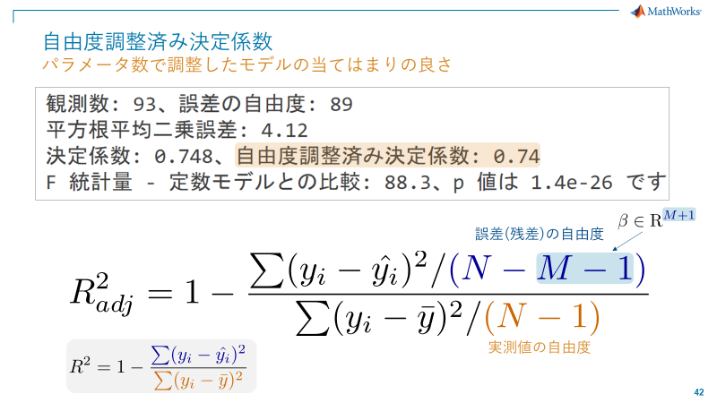

B :

「それも良いフィッティングの指標ですね。他には何か知っていますか？」

### 問題2.2：他のフィッティング指標は?
  

**答え1：**オーバーフィッティングを考慮した、情報量基準という概念を知っておこう。

情報量基準のモデル選択の方法の1つに最小AIC方式がある:

```matlab:Code
linear_mdl_1.ModelCriterion.AIC
```

```text:Output
ans = 530.9183
```

```matlab:Code
linear_mdl_2.ModelCriterion.AIC
```

```text:Output
ans = 531.1625
```

情報量基準 - データが生まれてきたモデルと、推定したモデルの近さを指標にしている。「データの当てはまり」よりも、将来の予測がうまくいくかどうかに注目した基準。本来は最尤推定によるデータフィッティングの概念ではあるが、最小二乗法は確率密度分布として正規分布を仮定しており、最尤推定解 = 最小二乗解であるため、当該指標を利用することが出来る。

$$
AIC=-2\log L({\theta })+2k
$$

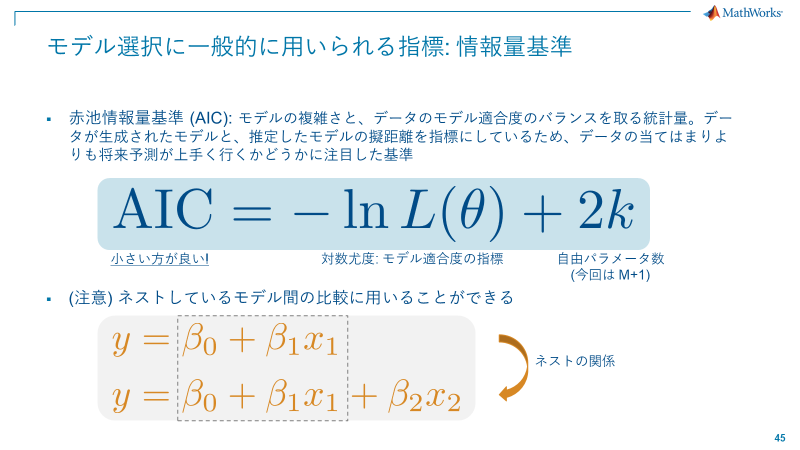

**答え2** : 加えた項が意味があるか確認しながら自動的に一番いいモデルを選ぶ

```matlab:Code
%stepwise_mdl = stepwiselm(tbl,'MPG ~ Weight', 'Upper', 'poly300000','Criterion','sse','verbose',2) % F value
%stepwise_mdl = stepwiselm(tbl,'MPG ~ Weight', 'Upper', 'poly300000','Criterion','aic','verbose',2) % AIC
stepwise_mdl = stepwiselm(tbl,'MPG ~ Weight', 'Upper', 'poly300000','Criterion','adjrsquared','verbose',2) % Ajusted R^2
```

```text:Output
   Weight^2 を追加する AdjRsquared 内の変化 は 0.0030452 です
1。Weight^2, AdjRsquared = 0.73827 を追加中
   Weight^3 を追加する AdjRsquared 内の変化 は 0.0017204 です
2。Weight^3, AdjRsquared = 0.73999 を追加中
   追加する候補項はありません
   削除する候補項はありません
stepwise_mdl = 
線形回帰モデル: 
    MPG ~ 1 + Weight + Weight^2 + Weight^3

推定された係数: 
                    Estimate         SE         tStat     pValue 
                   __________    __________    _______    _______
    (Intercept)        24.278        28.374    0.85563     0.3945
    Weight            0.02036      0.028588     0.7122     0.4782
    Weight^2       -1.061e-05    9.2644e-06    -1.1452    0.25519
    Weight^3       1.2224e-09    9.6777e-10     1.2631    0.20984

観測数: 93、誤差の自由度: 89
平方根平均二乗誤差: 4.12
決定係数: 0.748、自由度調整済み決定係数: 0.74
F 統計量 - 定数モデルとの比較: 88.3、p 値は 1.4e-26 です
```

  

**答え2の補足**：F値は、$F=\frac{定数(一定)モデル残差}{フィットしたモデル残差}$ を検定統計量として、定数モデルに対して検討しているモデルとに差がある (意味がある) かを判断する材料になる。この場合の帰無仮説は、$H_0 :$係数が全て0、$H_1 :$対立仮説は係数の少なくとも1つが0でない。

`stepwiselm` は指標を見ながら、項を足したり引いたりして、より良いモデルを段階的に探していく手法。

stepwise - GUI Tool

```matlab:Code
stepwise(tbl{:,["Weight","Acceleration","Cylinders","Displacement","Horsepower","Model_Year"]},tbl.MPG)
```

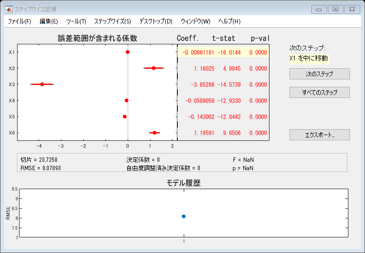

## (自習用) ツールの紹介

```matlab:Code
methods(linear_mdl_1) % properties(linear_mdl_1)
```

```text:Output
クラス LinearModel に対するメソッド:

addTerms               plotAdjustedResponse   
anova                  plotDiagnostics        
coefCI                 plotEffects            
coefTest               plotInteraction        
compact                plotPartialDependence  
disp                   plotResiduals          
dwtest                 plotSlice              
feval                  predict                
gather                 random                 
partialDependence      removeTerms            
plot                   step                   
plotAdded              
```

  

**最初に見るべき残差プロット** - 正規分布の形かどうか？をチェック

```matlab:Code
plotResiduals(linear_mdl_1)
```


  

**てこ比のプロット** - モデル推定に影響力のありすぎる観測値が無いかチェック

$$
\begin{array}{l}
{\hat{y} }_k =h_{1k} y_1 +h_{2k} y_2 +\cdots +h_{kk} y_k +\cdots +h_{nk} y_n \\
y_{kk} ~~\textrm{がてこ比}
\end{array}
$$

```matlab:Code
plotDiagnostics(linear_mdl_1)
```


  

**「てこ比」データ** - 推奨される閾値 *2p/n*  (pはパラメータ数)

```matlab:Code
% てこ比の目安
t_leverage_threshold = 2*linear_mdl_1.NumCoefficients/linear_mdl_1.NumObservations
```

```text:Output
t_leverage_threshold = 0.0430
```

```matlab:Code
% てこ比のデータ
t_leverage_actual = linear_mdl_1.Diagnostics.Leverage;
% 閾値以上のデータ探し
find(t_leverage_actual > t_leverage_threshold)
```

```text:Output
ans = 7x1    
     7
     9
    26
    27
    28
    29
    60

```

※ これ以降、計算で”警告”が出ますが理由があります。理由は後ほど回収します。

**モデル/モデル成分の有意性をチェック**- ANOVA (係数が応答$y$に対して意味があるか, F検定 vs コンスタントモデル)

```matlab:Code
anova(stepwise_mdl)
```

```text:Output
警告: 行列は、特異行列に近いか、正しくスケーリングされていません。結果は不正確になる可能性があります。RCOND =  1.354706e-25。
警告: 行列は、特異行列に近いか、正しくスケーリングされていません。結果は不正確になる可能性があります。RCOND =  3.434319e-19。
```

| |SumSq|DF|MeanSq|F|pValue|
|:--:|:--:|:--:|:--:|:--:|:--:|
|1 Weight|4.4321e+03|1|4.4321e+03|261.1627|0|
|2 Weight^2|35.1698|1|35.1698|2.0724|0.1535|
|3 Weight^3|27.0765|1|27.0765|1.5955|0.2098|
|4 Error|1.5104e+03|89|16.9707|1|0.5000|

  

**線形回帰モデルの係数に対する線形仮説検定**

コンスタントモデルに対するモデルの有意性検定

```matlab:Code
[p, F] = coefTest(stepwise_mdl)
```

```text:Output
警告: 行列は、特異行列に近いか、正しくスケーリングされていません。結果は不正確になる可能性があります。RCOND =  3.434319e-19。
p = 1.3977e-26
F = 88.2768
```

  

**残差の自己相関のチェック - **ダービン・ワトソン検定

残差（モデルのノイズ）の仮定として、「それぞれ独立に分布する」を満たしているのか確認。

$$
d\sim (0,4)
$$

正の自己相関が強いと$d\to 0$

```matlab:Code
d = dwtest(stepwise_mdl)
```

```text:Output
d = 4.0410e-07
```

  

**パラメータを選んでモデルを確認**

追加変数プロット、偏回帰てこプロット という。複数の変数からなる回帰 (重回帰) モデルから、1つの変数に関しての影響を確認する。

`plotAdded`(model, [使うパラメータの番号])

```matlab:Code
plotAdded(linear_mdl_2,"Weight")
```


## 3. 脆い線形回帰

A: 

「今度は、Model_Year を加えて回帰してみたいです。所謂、重回帰分析ってヤツですね。」

```matlab:Code
tbl.Model_Year = categorical(tbl.Model_Year);
mcol_fine = fitlm(tbl,"MPG~1 + Weight + Model_Year");
disp(mcol_fine);
```

```text:Output
線形回帰モデル: 
    MPG ~ 1 + Weight + Model_Year

推定された係数: 
                      Estimate         SE         tStat       pValue  
                     __________    __________    _______    __________
    (Intercept)          39.897        1.5305     26.068    1.9419e-43
    Weight           -0.0065843    0.00042509    -15.489    5.3727e-27
    Model_Year_76        1.9477       0.73977     2.6329     0.0099823
    Model_Year_82        8.1301       0.85057     9.5585    2.6198e-15

観測数: 93、誤差の自由度: 89
平方根平均二乗誤差: 2.88
決定係数: 0.877、自由度調整済み決定係数: 0.873
F 統計量 - 定数モデルとの比較: 211、p 値は 2.53e-40 です
```

  

B:

「最初のモデル (下) と比較すると、決定係数が大幅向上ですね。」

「一応、ウィルキンソンの表記法を再度アップデートしておきます。」


B:

「ではAさん、さらにHorsepowerを加えて重回帰分析をしてみましょう (ニヤニヤ) 」

```matlab:Code
mcol_horp = fitlm(tbl,"MPG~1 + Weight + Model_Year + Horsepower");
disp(mcol_horp);
```

```text:Output
線形回帰モデル: 
    MPG ~ 1 + Weight + Horsepower + Model_Year

推定された係数: 
                      Estimate         SE         tStat       pValue  
                     __________    __________    _______    __________
    (Intercept)          39.863        1.5289     26.072    3.6414e-43
    Weight           -0.0057673    0.00085191    -6.7698     1.384e-09
    Horsepower        -0.018408      0.016641    -1.1062       0.27166
    Model_Year_76        1.3281       0.92714     1.4325       0.15554
    Model_Year_82        7.6755       0.94371     8.1333    2.4757e-12

観測数: 93、誤差の自由度: 88
平方根平均二乗誤差: 2.88
決定係数: 0.878、自由度調整済み決定係数: 0.873
F 統計量 - 定数モデルとの比較: 159、p 値は 2.19e-39 です
```

A:

「性能は大して上がっていない感じだけど、ちょっと様子が違うな...うーん。」

B:

「気が付きましたね。ボチボチ今まで放置してきた他の指標も考えないといけない段階に達しましたね...」

「一応、情報量基準のメトリクスも確認しましょう」

```matlab:Code
mcol_horp.ModelCriterion
```

```text:Output
ans = 
     AIC: 465.5910
    AICc: 466.2807
     BIC: 478.2540
    CAIC: 483.2540
```

```matlab:Code
mcol_fine.ModelCriterion
```

```text:Output
ans = 
     AIC: 464.8753
    AICc: 465.3299
     BIC: 475.0057
    CAIC: 479.0057
```

### ディスカッション 2: どちらのモデルがより良いモデル?

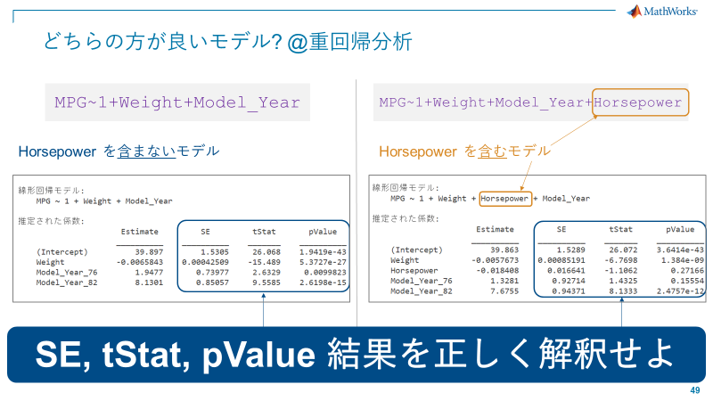

### 問題3.1：結果を正しく解釈せよ
  

**答え:**

*SE*

線形回帰で得られるパラメータは正規分布に従う。

これは、線形回帰はノイズの確率密度分布に正規分布を仮定しているとみなされるから。

$$
\hat{{\beta }} \sim N({\beta },\sigma^2 (X^T X)^{-1} )
$$

この分散部分のルートがSE (Standard Error) - 従って「パラメータの確からしさ」の指標として捉えることができる。

測定/観測ノイズの大きさ比例し、多重共線性がある場合にも大きくなる。

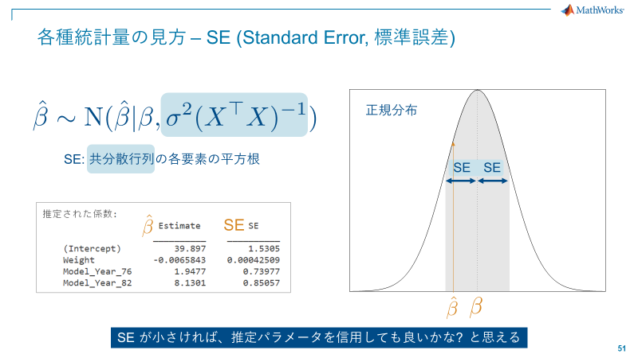

*tStat*

帰無仮説 $\beta_i =0$のt検定時のt値。この値が大きいほど、パラメータがゼロである可能性が低くなる。

が、t分布からの値であるため、自由度を考慮しないと数値自体では何も判断を下せない。

`tStat = Estimate/SE`

*pValue*

t値を有意水準と比較するための確率値。t分布におけるt値以上の確率。

この値を見て有意水準（自分で設定）と比較して$\beta_i =0$を棄却するかしないかを判断。

p値が小さいということは、変数の係数がゼロでは無い (つまり意味がある) と見なされる。

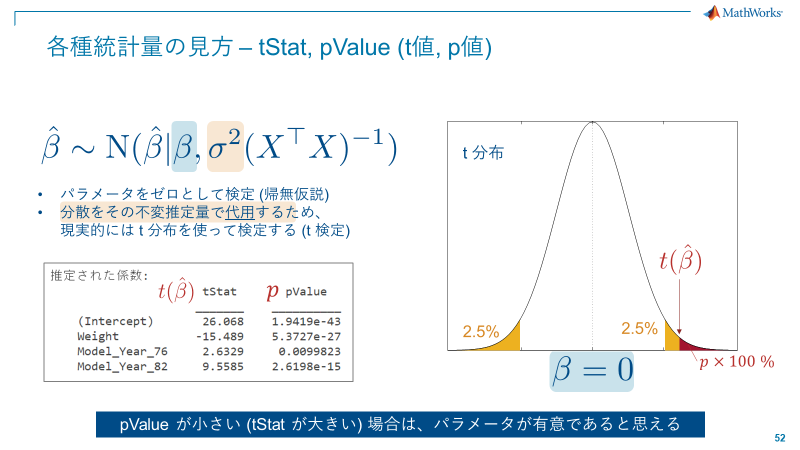

### 問題3.2：どちらのモデルが結局良くて、その結論の根本的な原因は何か?

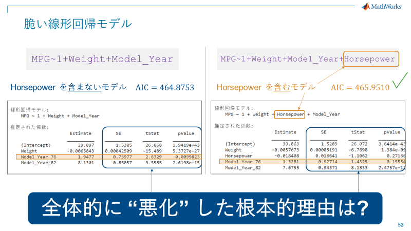

**答え：馬力 (Horsepower) を加えない方が良い。多重共線性のため。**

多重共線性について理論ベースで説明する。

$y=X{\beta }+{\epsilon }$ の最小二乗解は  $\hat{{\beta }} =(X^T X)^{-1} X^T y$

$X=U\Lambda V^T$: 特異値分解

$$
\begin{array}{l}
(X^T X)^{-1} X^T =\sum \frac{1}{\gamma_j }v_j u_j^T \\
\therefore \hat{{\beta }} ={\beta }+\sum \frac{1}{\gamma_j }v_j u_j^T {\epsilon }
\end{array}
$$

$X$の列ベクトルの相関が高い場合、$\gamma$の値が小さくなりがち。

その場合、最小二乗解が不安定になる。

  

つまり

多重共線性とは、$X$の列ベクトルの相関が高い場合、解が怪しくなる。(列とは限らず、ランク落ちに近い状態を指す)

事前に相関係数を確認して、怪しい回帰の推定は避けるべき!

```matlab:Code
corrNames = ["Weight","Acceleration","Horsepower","Cylinders","Displacement"];
corrTbl = corrcoef(table2array(tbl(:,corrNames)));
heatmap(corrTbl,"XData",corrNames,"YData",corrNames);
```


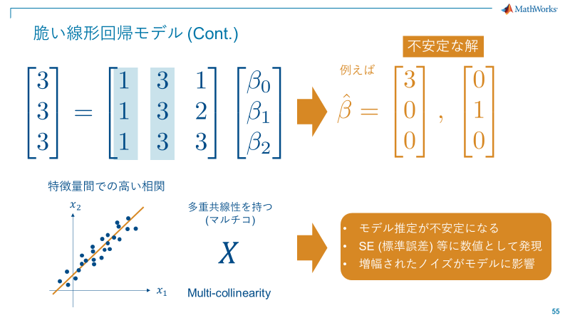


  

A:

「相関マップを見ると、Displacement と Horsepower が非常に相関が高いというのが分りますね。」

「わざと、両者を入れればp値は非常に大きくなるはず...」

```matlab:Code
mcol_Disp = fitlm(tbl,"MPG~1 + Weight + Model_Year + Displacement + Horsepower");
disp(mcol_Disp);
```

```text:Output
線形回帰モデル: 
    MPG ~ 1 + Weight + Horsepower + Displacement + Model_Year

推定された係数: 
                      Estimate         SE         tStat       pValue  
                     __________    __________    _______    __________
    (Intercept)          40.214        1.6905     23.789    7.6648e-40
    Weight           -0.0059711    0.00094879    -6.2933    1.2174e-08
    Horsepower        -0.023284       0.01938    -1.2014       0.23285
    Displacement      0.0037551     0.0075575    0.49687       0.62053
    Model_Year_76        1.3545       0.93264     1.4523       0.15002
    Model_Year_82        7.7362       0.95563     8.0954    3.1667e-12

観測数: 93、誤差の自由度: 87
平方根平均二乗誤差: 2.89
決定係数: 0.879、自由度調整済み決定係数: 0.872
F 統計量 - 定数モデルとの比較: 126、p 値は 2.61e-38 です
```

B:

「今回のモデルでは、Weight と Acceleration に加えて、Model_year を入れておけば安定した推定ができるのでは？と考えられますね。」 

## 4. データの標準化

A:

「指標が理解できて、ちょっと思ったのですが、確率変数 $x$ に対して

$$
\begin{array}{l}
x\sim {Pr}(x|{\theta })\\
V(x)=\sigma^2 \;\to V(10x)=100\sigma^2 
\end{array}
$$

であるので、単位が異なると標準誤差が変わったり、目的変数に対する影響を直接比較出来なく無いですか？」

B:

「その通りです。ちょっとこちらを見てください。重量 Weight を kg >> ton と変換して回帰モデルを作成します」

```matlab:Code
mcol_org = fitlm(tbl,'MPG~1 + Weight + Cylinders');
disp(mcol_org);
```

```text:Output
線形回帰モデル: 
    MPG ~ 1 + Weight + Cylinders

推定された係数: 
                    Estimate        SE         tStat       pValue  
                   __________    _________    _______    __________
    (Intercept)        48.912       1.5801     30.954    9.2075e-50
    Weight         -0.0055097    0.0011201    -4.9187    3.9038e-06
    Cylinders         -1.6037      0.51458    -3.1165     0.0024566

観測数: 93、誤差の自由度: 90
平方根平均二乗誤差: 3.97
決定係数: 0.764、自由度調整済み決定係数: 0.758
F 統計量 - 定数モデルとの比較: 145、p 値は 6.5e-29 です
```

```matlab:Code
% kg >> ton
tbl.Weight = tbl.Weight /1000;
mcol_ton = fitlm(tbl,'MPG~1 + Weight + Cylinders');
disp(mcol_ton);
```

```text:Output
線形回帰モデル: 
    MPG ~ 1 + Weight + Cylinders

推定された係数: 
                   Estimate      SE        tStat       pValue  
                   ________    _______    _______    __________
    (Intercept)     48.912      1.5801     30.954    9.2075e-50
    Weight         -5.5097      1.1201    -4.9187    3.9038e-06
    Cylinders      -1.6037     0.51458    -3.1165     0.0024566

観測数: 93、誤差の自由度: 90
平方根平均二乗誤差: 3.97
決定係数: 0.764、自由度調整済み決定係数: 0.758
F 統計量 - 定数モデルとの比較: 145、p 値は 6.5e-29 です
```

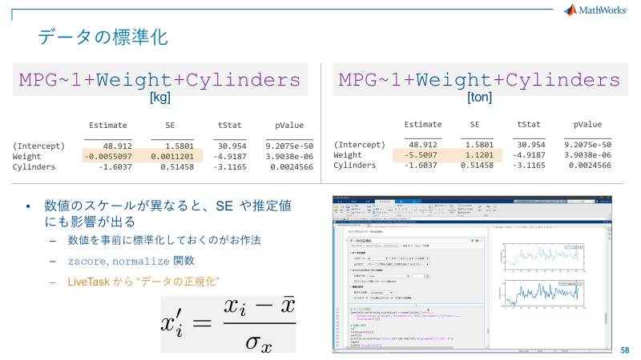

A:

「当たり前と言えば、当たり前だけど...これは不便だな。直接比較が変数間で出来ないのは。」

B:

「その通りです。回帰モデルを構築する場合は、**各変数を最初に何らかの形で標準化しておくことがお作法**と言えます」

A:

「データを受け取ったら最初に行っておくということですね。今回はそのままやっていました...」

**データの標準化**

B:

「データの標準化には様々なやり方がありますが、Z スコアを用いると平均 0、標準偏差 1 の予測子にすることができます。」

$$
z=\frac{x-\mu }{\sigma }
$$

```matlab:Code
% (注意) 引数にtable型をとれない
[tbl_z, mu, sigma] = zscore(tbl{:,1:end-1});
```

B:

「標準化後、table にデータを戻しておきます。」

```matlab:Code
% 配列を再度table型に変換する
tbl_z = array2table(tbl_z,...
    'VariableNames', tbl.Properties.VariableNames(1:end-1));
tbl_z.Model_Year = tbl.Model_Year;
```

B:

「ライブタスクを使うと試行錯誤が簡単に行えます」

ライブタスク: データの正規化

```matlab:Code
% データの正規化
[newTable,centerValue,scaleValue] = normalize(tbl,"norm",...
    "DataVariables",["Weight","Acceleration","MPG","Horsepower","Cylinders",...
    "Displacement"]);

% 結果の表示
clf
tiledlayout(2,1);
nexttile
plot(tbl.Acceleration,"Color",[77 190 238]/255,"DisplayName","入力データ")
legend
ylabel("Acceleration")

nexttile
plot(newTable.Acceleration,"Color",[0 114 189]/255,"LineWidth",1.5,...
    "DisplayName","正規化されたデータ")
legend
ylabel("Acceleration")
```


```matlab:Code
figure
```

# ポイントまとめ2


## 最終的なモデル

A:

「これで今回のデータを使ったモデルを作成できますね！」

```matlab:Code
mcol_z = fitlm(tbl_z,'MPG~1+Weight+ Acceleration + Model_Year');
disp(mcol_z);
```

```text:Output
線形回帰モデル: 
    MPG ~ 1 + Weight + Acceleration + Model_Year

推定された係数: 
                     Estimate       SE        tStat       pValue  
                     ________    ________    _______    __________
    (Intercept)      -0.41025    0.073911    -5.5507    2.9677e-07
    Weight            -0.6551    0.045703    -14.334     9.754e-25
    Acceleration       0.0049     0.04563    0.10738       0.91473
    Model_Year_76     0.23718    0.098997     2.3958      0.018701
    Model_Year_82       1.003     0.11039     9.0859    2.7316e-14

観測数: 93、誤差の自由度: 88
平方根平均二乗誤差: 0.359
決定係数: 0.877、自由度調整済み決定係数: 0.871
F 統計量 - 定数モデルとの比較: 156、p 値は 3.99e-39 です
```

```matlab:Code
plot(mcol_z);
```


*Copyright 2022 - 2022 The MathWorks, Inc*
