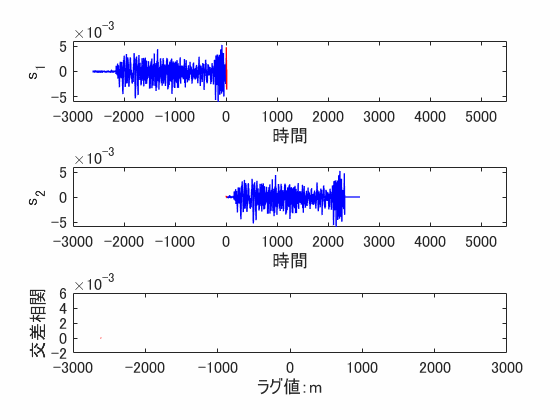
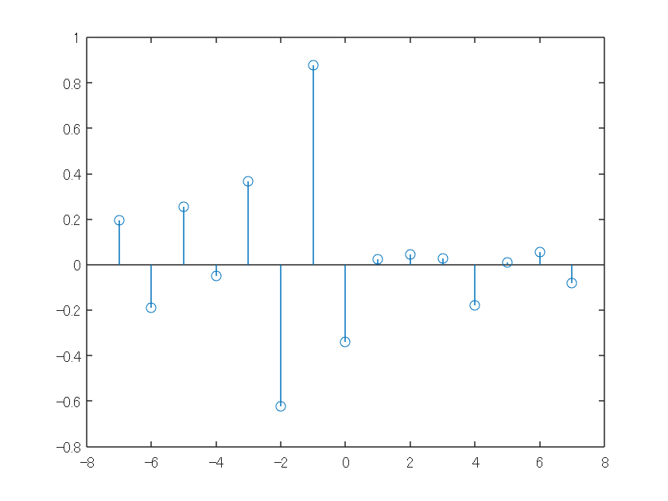
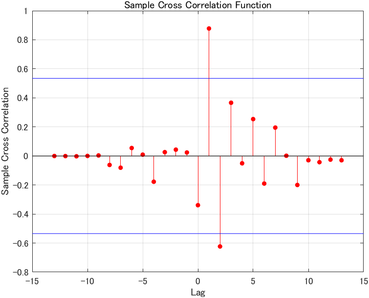
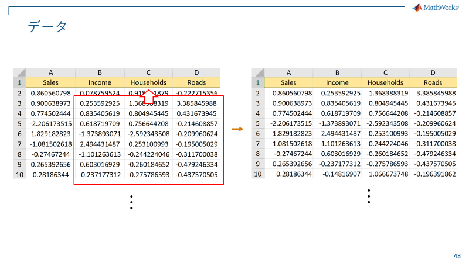
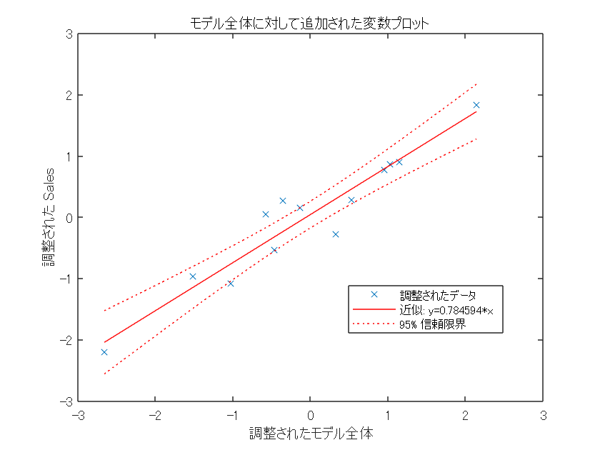
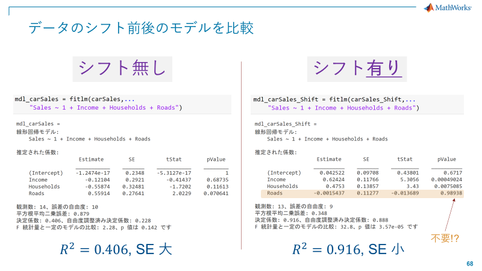
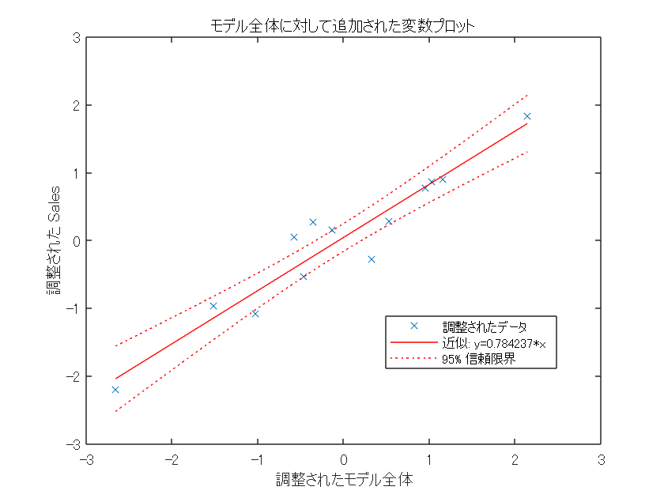
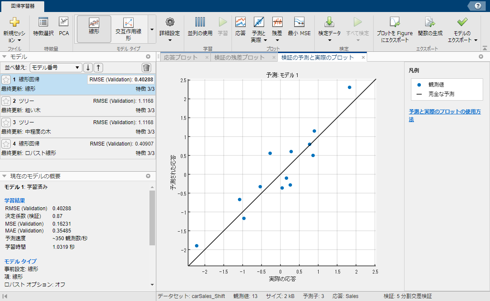

# 統計モデリングの教科書: 線形回帰モデル
# データ解析のための統計モデリング \#3 実践編

```matlab:Code
clear;
close all;
```

## 6. 実践データ解析: 自動車の売上予測モデル作成
### 標準化

A:

「自動車の燃費を予測する線形回帰モデルを作成しましたが、そこで学んだ事を活かして、今度は売上予測を行いたいです」

B:

「最初にやることは？」

A:

「標準化・正規化ですね。次のエクセルに正規化されたデータを既に用意できています ww 」


```matlab:Code
carSales = readtable("carSales.xlsx");
head(carSales)
```

| |Sales|Income|Households|Roads|
|:--:|:--:|:--:|:--:|:--:|
|1|0.8606|0.0788|0.9184|-0.2227|
|2|0.9006|0.2536|1.3684|3.3858|
|3|0.7745|0.8354|0.8049|0.4317|
|4|-2.2062|0.6187|0.7566|-0.2146|
|5|1.8292|-1.3739|-2.5923|-0.2100|
|6|-1.0815|2.4944|0.2531|-0.1950|
|7|-0.2747|-1.1013|-0.2442|-0.3117|
|8|0.2654|0.6030|-0.2602|-0.4792|

A:

「自動車の Sales を、Income, Households, Roads から回帰をします。」

B:

「一応確認しましょう。平均値と標準偏差です。」

```matlab:Code
mean(carSales.Variables,1)
```

```text:Output
ans = 1x4    
1.0e-15 *

    0.0753   -0.1308   -0.1150   -0.0436

```

```matlab:Code
std(carSales.Variables,0,1)
```

```text:Output
ans = 1x4    
    1.0000    1.0000    1.0000    1.0000

```

A:

「大丈夫ですね！std の2つ目の引数はなんだろう....」

B:

「所謂、不変分散か標本分散のどちらにするかのオプションですね。標本分散の期待値は

$$
\mathbb{E}\left\lbrack \frac{1}{n}\sum_{i=1}^n (x_i -\bar{x} )^2 \right\rbrack =\frac{n-1}{n}\sigma^2
$$

なので、不変推定量では無いです。ここではオプションで 0 なので、不変分散

$$
\frac{1}{n-1}\sum_{i=1}^n (x_i -\bar{x} )^2
$$

を計算して標準偏差の推定に用いています。」

### 多重共線性のチェック

B:

「さて、次に何をしましょう？」

A:

「多重共線性 (マルチコ) のチェックと排除です」

```matlab:Code
corrTbl = corrcoef(table2array(carSales(:,2:end)));
heatmap(corrTbl,"XData",{'Income', 'Households', 'Roads'},"YData",{'Income', 'Households', 'Roads'});
```


A:

「予測子間の相関はそこまで高くないので、これはそのまま使えそうですね !」

B:

「ちなみに、Econometrics Toolbox™ があれば、こんな風に相関を見ることもできます」

```matlab:Code(Display)
figure;
corrplot(carSales(:,2:end));
```


B:

「では、早速モデルを作成していただきましょうか (ニヤニヤ)」

### **重回帰**

A:

「いつも通りに...」

```matlab:Code
mdl_carSales = fitlm(carSales, "Sales ~ 1 + Income + Households + Roads");
disp(mdl_carSales);
```

```text:Output
線形回帰モデル: 
    Sales ~ 1 + Income + Households + Roads

推定された係数: 
                    Estimate        SE          tStat        pValue 
                   ___________    _______    ___________    ________
    (Intercept)    -7.4136e-17     0.2348    -3.1574e-16           1
    Income            -0.12104     0.2921       -0.41437     0.68735
    Households        -0.55874    0.32481        -1.7202     0.11613
    Roads              0.55914    0.27641         2.0229    0.070641

観測数: 14、誤差の自由度: 10
平方根平均二乗誤差: 0.879
決定係数: 0.406、自由度調整済み決定係数: 0.228
F 統計量 - 定数モデルとの比較: 2.28、p 値は 0.142 です
```

A: 

「p値が大きい !! ... Income, Households は Sales と関係が無い?! うーん、ちょっと自分の予想と違うな...何かが変な気がします...」

B:

「自動車の販売台数と住民の所得には明らかに相関があることが予想されるので、ここでは時間的な交差相関を見てみてはどうでしょうか？」

A:

「えっ? ... 交差相関?」

### 問題6.1： 交差相関とは何か?
  

**答え:** 信号同士の (時間軸に沿った) 相関関係のこと

$$
C_{xy} (m)=\left\lbrace \begin{array}{ll}
\sum_n x_{n+m} \cdot y_n  & (m\ge 0)\\
\sum_n y_{n-m} \cdot x_n  & (m<0)
\end{array}\right.
$$

Convolution と似ていますが、少し異なる計算。ラグ m に沿って 2つの信号の類似度を表現


計算イメージは以下。2つの信号の重なりが強いところでピークが立つ。



A:

「そういうことか。自動車の販売台数と住民の所得が時系列でズレていたため、上手くモデルに反映されなかったのか！」

B:

「こういうのを、ドメインナレッジと言いますね。専門領域で培った常識もフル活用するべきですね。」

「では、xcorrという関数を使ってズレを計算しましょう。」

## **7. 交差相関**

```matlab:Code
sales = carSales.Sales; %
income = carSales.Income;

% Cross correlation
[cr, lags] = xcorr(sales, income, 7, 'normalized');
stem(lags, cr);
```



A: 

「ピークを見ると1つラグ (ズレ) があるという事が分かりました。」

B:

「因みに、こういった話は金融工学では良く検討される話なので、Econometrics Toolbox を使えば一瞬で ....」

```matlab:Code(Display)
crosscorr(sales, income);
```



A:

「青線は何ですか？」

B:

「これは、交差相関の検定です。有意水準 5% 線がデフォルト値です。相関が有意なのは Lag = 1 となります。」

A:

「検定までしてくれるなんて、便利ですね。」

「では、データを1つシフトして、モデルが上手く作成できるようにします」



### 交差相関を排除

**1つだけシフトしたデータ読み込み (エクセル操作で事前に準備済み) **

```matlab:Code
carSales_Shift = readtable("carSales_Shift.xlsx");
mdl_carSales_Shift = fitlm(carSales_Shift, "Sales ~ 1 + Income + Households + Roads");
disp(mdl_carSales_Shift);
```

```text:Output
線形回帰モデル: 
    Sales ~ 1 + Income + Households + Roads

推定された係数: 
                    Estimate       SE         tStat        pValue  
                   __________    _______    _________    __________
    (Intercept)      0.042522    0.09708      0.43801        0.6717
    Income            0.62424    0.11766       5.3056    0.00049024
    Households         0.4753    0.13857         3.43     0.0075085
    Roads          -0.0015437    0.11277    -0.013689       0.98938

観測数: 13、誤差の自由度: 9
平方根平均二乗誤差: 0.348
決定係数: 0.916、自由度調整済み決定係数: 0.888
F 統計量 - 定数モデルとの比較: 32.8、p 値は 3.57e-05 です
```

```matlab:Code
plot(mdl_carSales_Shift);
```



**Hint:** 重回帰の二次元プロット - Frisch–Waugh–Lovell theorem

A: 

「おおお！改善した！！」



B: 

「上手くいきましたね。各種統計量も健全そうですし、係数の正負も悪くありません。p 値を見ると、舗装された道路はあまり関係ないかも知れないので外してもよさそうですね。」

```matlab:Code
mdl_carSales_Shift2 = fitlm(carSales_Shift, "Sales ~ 1 + Income + Households");
disp(mdl_carSales_Shift2);
```

```text:Output
線形回帰モデル: 
    Sales ~ 1 + Income + Households

推定された係数: 
                   Estimate       SE       tStat       pValue  
                   ________    ________    ______    __________
    (Intercept)    0.042431    0.091881    0.4618       0.65411
    Income          0.62451     0.11004    5.6754    0.00020514
    Households      0.47436     0.11407    4.1586      0.001953

観測数: 13、誤差の自由度: 10
平方根平均二乗誤差: 0.33
決定係数: 0.916、自由度調整済み決定係数: 0.899
F 統計量 - 定数モデルとの比較: 54.6、p 値は 4.15e-06 です
```

B:

「AIC チェックしましょう。」

```matlab:Code
mdl_carSales_Shift.ModelCriterion
```

```text:Output
ans = 
     AIC: 12.6652
    AICc: 17.6652
     BIC: 14.9250
    CAIC: 18.9250
```

```matlab:Code
mdl_carSales_Shift2.ModelCriterion
```

```text:Output
ans = 
     AIC: 10.6655
    AICc: 13.3321
     BIC: 12.3603
    CAIC: 15.3603
```

A:

「"Road" を削った方が良いですね！」

A:

「最終的にこれで行きます」

```matlab:Code
plot(mdl_carSales_Shift2);
```



```matlab:Code
disp(mdl_carSales_Shift2);
```

```text:Output
線形回帰モデル: 
    Sales ~ 1 + Income + Households

推定された係数: 
                   Estimate       SE       tStat       pValue  
                   ________    ________    ______    __________
    (Intercept)    0.042431    0.091881    0.4618       0.65411
    Income          0.62451     0.11004    5.6754    0.00020514
    Households      0.47436     0.11407    4.1586      0.001953

観測数: 13、誤差の自由度: 10
平方根平均二乗誤差: 0.33
決定係数: 0.916、自由度調整済み決定係数: 0.899
F 統計量 - 定数モデルとの比較: 54.6、p 値は 4.15e-06 です
```

B:

「お疲れさまでした！ポイントまとめをよく読んで復習してください！」

A:

「線形回帰って結構深いんですね .... 色々な回帰モデルを簡単に作る方法って無いんでしょうか...」

B:

「では、それは\hyperref[H_963C028E]{こちら}でお伝えしましょう!」

# ポイントまとめ4


# Appendix: 機械学習アプリ

```matlab:Code
regressionLearner;
```




B:

「このアプリを使うと、右側のリストにあるアルゴリズムを一気に学習して、評価することができます。」

  

*Copyright 2022 - 2022 The MathWorks, Inc*
