# 統計モデリングの教科書: 線形回帰モデル
# データ解析のための統計モデリング \#1 理論編 (1)

```matlab:Code
clear;
close all;
```

## 1. 信頼区間と予測区間

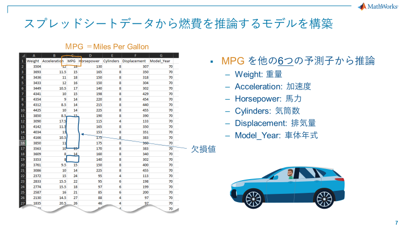

A:

「開発中の車の燃費を良くしたいんだよなー。やっぱり重量って効いてくると思うんだけど…」

「定量化への第一歩は、もちろん線形回帰でしょ。まずはデータをインポート。」

```matlab:Code
GUIdataImport = false;
if GUIdataImport
    uiimport("tblraw.xlsx");
else
    load tblraw.mat
end
```

```matlab:Code(Display)
% MATLAB のデータサンプルからインポートする場合
load carsmall.mat
tblraw = table(Weight,Acceleration,MPG, Horsepower, Cylinders, Displacement, Model_Year);
tblraw.Properties.VariableNames = {'Weight','Acceleration','MPG', 'Horsepower', 'Cylinders', 'Displacement', 'Model_Year'};
clearvars -except tblraw;
```

```matlab:Code(Display)
% csvファイルとして保存したいとき
filename = 'tblraw.csv';
writetable(tblraw,filename);
```

  

**練習**

   -  ファイルインポートアプリを使った、csv ファイルのインポートとエクスポート 
   -  ファイルインポートアプリから MATLAB コード生成 

**Pre-processing**

B:

「データに欠損があるので、それを綺麗にしておくのが"データサイエンス"のお作法です。MATLABには前処理用の関数が沢山あります。」

([データの前処理](https://jp.mathworks.com/help/matlab/preprocessing-data.html) 参照)

A:

「便利だとは思うけど、前処理は試行錯誤が必要なんだよな。関数をイチイチ実行するのは正直面倒くさいというか、生産性が悪くてやりたくない。」

「というか、Bさん、あなた誰?」

B:

「データ解析者は生産性悪いことを平気でやる人が多いのに、A さん変わっていますね。私が何者かは置いておいて、便利なツールをご紹介します」

「半 GUI で前処理が実行できる夢のツール Live Taskです！」

A:

「むむっ」

  


Live Task

```matlab:Code
% 欠損データの削除
[tbl,missingIndices] = rmmissing(tblraw);

% 結果の表示
clf
plot(find(~missingIndices),tbl.MPG,"Color",[0 114 189]/255,"LineWidth",1.5,...
    "DisplayName","クリーニング済みのデータ")
hold on

indicesForPlot = ismissing(tblraw.MPG);

% 他の変数に欠損エントリが含まれる行のデータをプロット
mask = missingIndices & ~indicesForPlot;
plot(find(mask),tblraw.MPG(mask),"x","Color",[64 64 64]/255,...
    "DisplayName","他の変数により削除")

% 削除された欠損エントリのプロット
x = repelem(find(indicesForPlot),3);
y = repmat([ylim(gca) missing]',nnz(indicesForPlot),1);
plot(x,y,"Color",[145 145 145]/255,"DisplayName","削除された欠損エントリ")
title("削除された欠損エントリの数: " + nnz(indicesForPlot))

hold off
legend
ylabel("MPG")
```

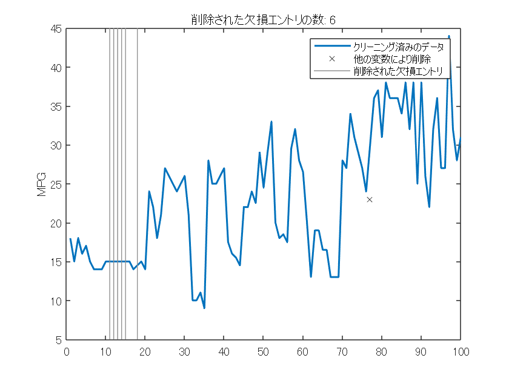

```matlab:Code
clear indicesForPlot mask x y
clearvars -except tbl tblraw
```

**Plot MPG vs Weight**

A:

「さて、データも綺麗になったのでプロットしてみるか」

```matlab:Code
plot(tbl.Weight, tbl.MPG,'bo');
xlabel("Weight");
ylabel("MPG");
set(gcf, 'visible', 'on');
```

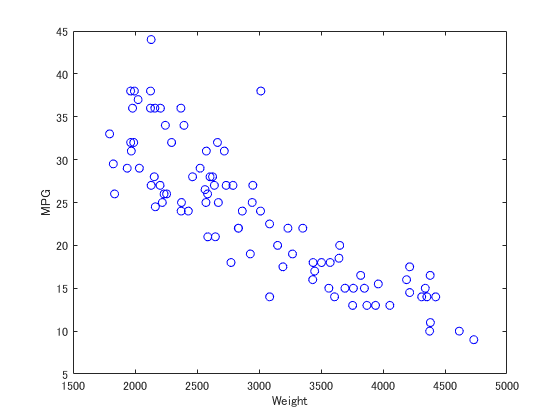

「ここに線を引くには、Figure の基本機能を使えば簡単！」

「係数も求まったので、9割作業は完了！。データ解析って楽勝だな。」

  

ツール >> 基本的な近似

を選択すると、簡単な近似モデルを作成できます。

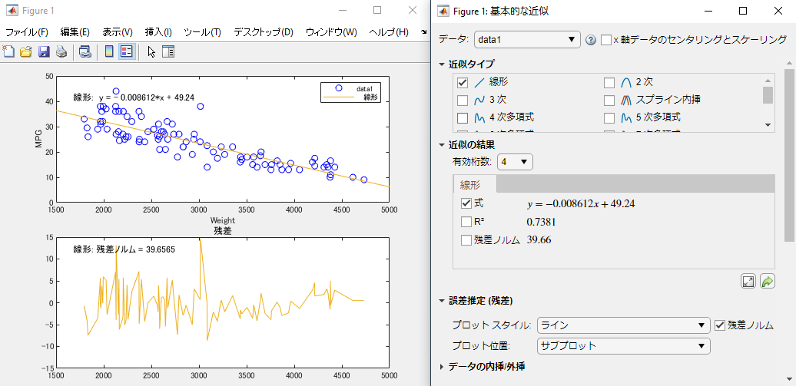

B:

「このくらいのことはエクセルでもできるので、もう少し"解析"っぽいことをやってみませんか？」

「以下のモデルを仮定して、線形回帰モデルを作りましょう」

$$
\begin{array}{l}
y=\beta_0 +\beta_1 x+\epsilon \\
\textrm{where}\;{y\;}\;\textrm{is}\;\textrm{MPG}\;\textrm{and}\;{x\;}\;\textrm{is}\;\textrm{Weight.}\\
\textrm{and}\;\textrm{where,}\;\epsilon \sim N(0,\sigma^2 ).
\end{array}
$$
  

A:

「ぐぬぬ。線形回帰....よく使うけど、じつはイマイチ分かっていないんだよな。知識を整理させて欲しい...」

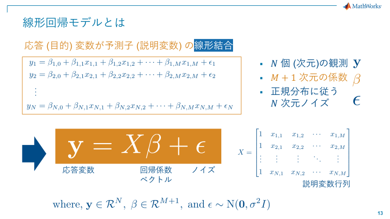

A:

「こんな感じ?」

B:

「良いまとめですね。予測子が1つの時を特に "単回帰" と言ったり、複数の時は "重回帰" などと呼びます。」

「この際、観測ノイズを平均 0 の正規分布に従う確率変数として扱います。式で書くと次のように表現します。」

$$
\epsilon \sim N(0,\sigma^2 )
$$
### 補足説明: 最尤推定法

\hfill \break

```matlab:Code
open("LogLikelihood.mlx");
```

A:

「線形回帰は fitlm を使ってこうすれば良し！」

```matlab:Code
linear_mdl = fitlm(tbl,"MPG~1+Weight");
disp(linear_mdl);
```

```text:Output
線形回帰モデル: 
    MPG ~ 1 + Weight

推定された係数: 
                    Estimate         SE         tStat       pValue  
                   __________    __________    _______    __________
    (Intercept)        49.238        1.6504     29.834    9.0258e-49
    Weight         -0.0086118    0.00053775    -16.014    3.2405e-28

観測数: 93、誤差の自由度: 91
平方根平均二乗誤差: 4.16
決定係数: 0.738、自由度調整済み決定係数: 0.735
F 統計量 - 定数モデルとの比較: 256、p 値は 3.24e-28 です
```

B:

「Aさん、MPG\textasciitilde{}1+Weight の表現は何かご存じですか?」

A:

「これはウィルキンソンの表記法です。これ以外にもモデルを指定する方法がありますが、今回はこれを使いました。」


A:

「解析結果が色々出てきたけど、線を引くだけだから、とりあえず出てきたオブジェクトをplotしちゃうと…」

```matlab:Code
plot(linear_mdl);
linear_mdl.Coefficients
```

| |Estimate|SE|tStat|pValue|
|:--:|:--:|:--:|:--:|:--:|
|1 (Intercept)|49.2383|1.6504|29.8344|9.0258e-49|
|2 Weight|-0.0086|0.0005|-16.0144|3.2405e-28|

「よしできた。係数もゲットできたし、オッケーだな。」

「決定係数も0.74だから相関バッチリだ！完璧！」

A:

「この図によると、weightが3000の場合の予想値は23くらい」

B:

「正確にやりましょう。feval を使って：」

```matlab:Code
y_pred_1500 = feval(linear_mdl,3000)
```

```text:Output
警告: クラス matlab.internal.language.RegionEvaluator に対して定義されたイベント POST_REGION のリスナー コールバックの実行中にエラーが発生しました。
無効であるか削除されたオブジェクトです。
エラー: matlab.internal.editor.figure.FigureDataTransporter.getFigureDataEF

エラー: matlab.internal.editor.figure.FigureDataTransporter.getFigureMetaData

エラー: matlab.internal.editor.FigureManager

エラー: matlab.internal.editor.FigureManager.saveSnapshot

エラー: matlab.internal.editor.FigureManager.snapshotAllFigures

エラー: LiveEditorEvaluationHelperE534798439 (行 45)
y_pred_1500 = feval(linear_mdl,3000)
y_pred_1500 = 23.4029
```

A:

「よしこれでプレゼンできますね！」

B:

「えっ....」

..... プレゼン当日 .....

C:

「Aさん、内容は分かりました。が、その図の中の赤線はなんですか？」

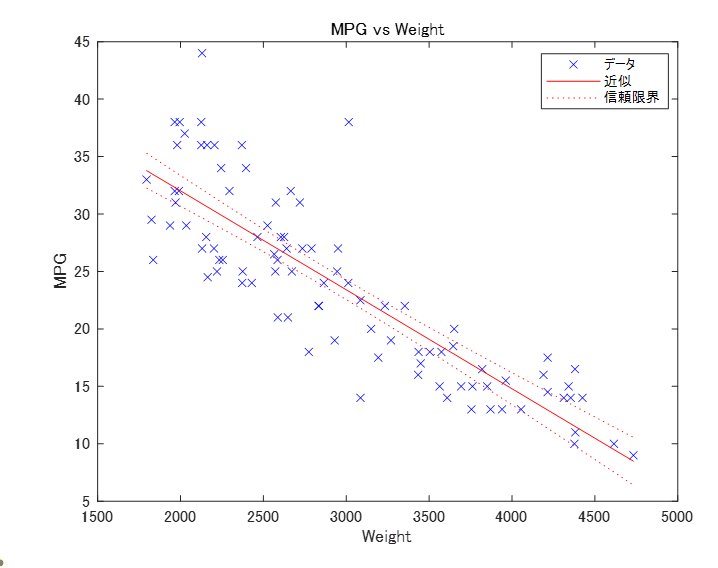

A:

「これは信頼区間といって、95％の確率での予想を表しています (ドヤ) 」

C:

「95%!? でも全然データがはみ出ていますね。どう見ても95%には見えないなぁー。どういう事か教えてください。」

A:

「確かに...ぐぬぬ...」

  
### **ディスカッション1: どういうことなのか?**

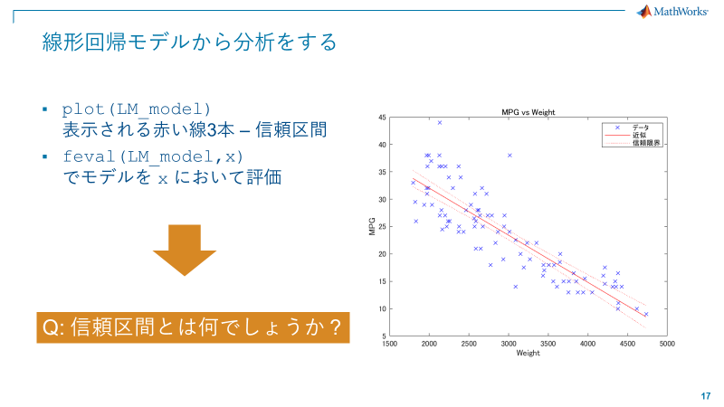

### 問題 1.1： Aさんの問題は何か？

答え:　これは「回帰曲線の信頼区間」を表しています。つまり、

「同じやり方でデータを集めて、同じように解析したら100回中95回はその枠の中に納まりますよ」

というだけの話。次に取得するデータの予測範囲を表す予測区間とは別の話。

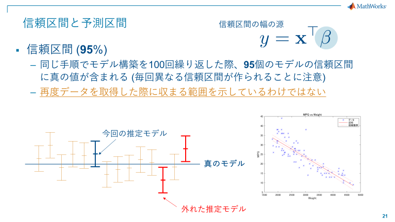

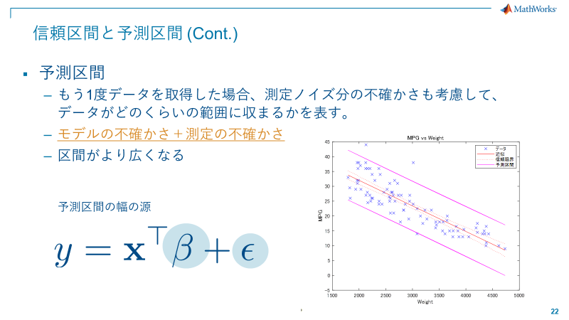

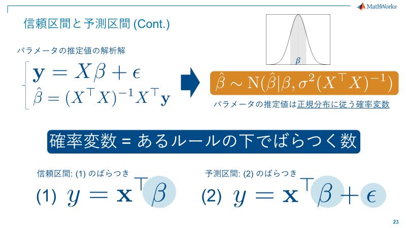

数式で書くと、

$$
\begin{array}{l}
y=X{\beta }+{\epsilon },\\
\hat{{\beta }} =(X^T X)^{-1} X^T y\\
\hat{{\beta }} \sim N({\beta },\sigma^2 (X^T X)^{-1} )
\end{array}
$$

信頼区間は

$$
\hat{y} =X\hat{{\beta }}
$$

予測区間は

$$
y_{pred} =\hat{y} +\epsilon
$$

の分だけ大きくなる。これを考慮に入れないとダメ。

### 実演： 信頼区間と予測区間の比較

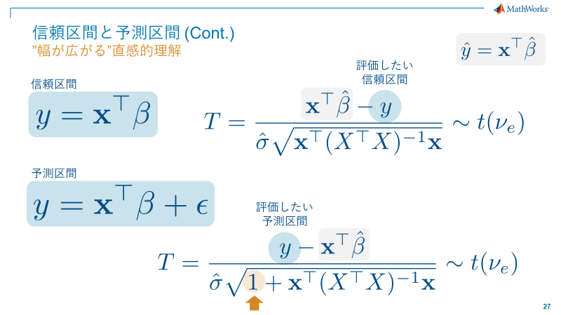

参考: [Confidence and Prediction Bounds](https://www.mathworks.com/help/curvefit/confidence-and-prediction-bounds.html)

参考: [predict](https://www.mathworks.com/help/stats/linearmodel.predict.html#namevaluepairarguments)

```matlab:Code
% データの並べ替え
tbl_new = sortrows(tbl,"Weight","ascend");

% モデル信頼区間
[~, y_confInt] = predict(linear_mdl, tbl_new,'Prediction','curve');

% 予測区間の計算
[y_mean, y_predInt] = predict(linear_mdl, tbl_new,'Prediction','observation');
```

上記の可視化 \& 重ねてプロット

```matlab:Code
plot(tbl_new.Weight,tbl_new.MPG,'xb', tbl_new.Weight, y_mean,'r-'); % 平均線のプロット
hold on;
plot(tbl_new.Weight, y_confInt(:,1),'r:', tbl_new.Weight, y_confInt(:,2),'r:'); % 信頼区間のプロット
plot(tbl_new.Weight, y_predInt(:,1),'k' , tbl_new.Weight, y_predInt(:,2),'k');  % 予測区間のプロット
xlabel("Weight");
ylabel("MPG");
legend('Data', 'Model', 'Confidence Interval',"",'Prediction Interval',"");
hold off;
```

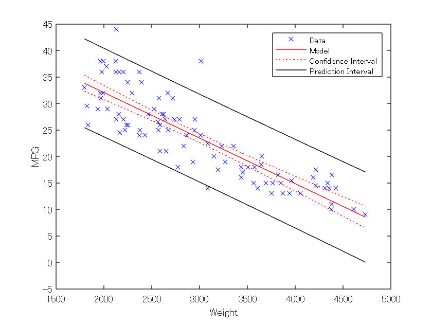

  

**補足説明 1**

'`Prediction`' オプションには'`curve`'と'`observation`'が選択できます。予測モデルは:

$$
y=f(X)+\epsilon
$$

で、$f$はフィットした回帰モデルです。

   \item{ '`curve`' - $f(X_{new} )$の信頼区間を返します。 }
   -  '`observatoin`' - $y$の信頼区間を返します。これは観測時のノイズ分散が乗っている分大きいです。 

**補足説明 2**

パラメータの信頼区間は `coefCI(mdl,alpha) `で取得できます。`alpha`によって任意の信頼区間を得ることが可能です。

95%なら`alpha` = 0.05とします。

### **線形モデルと線形回帰モデルの特徴まとめ**

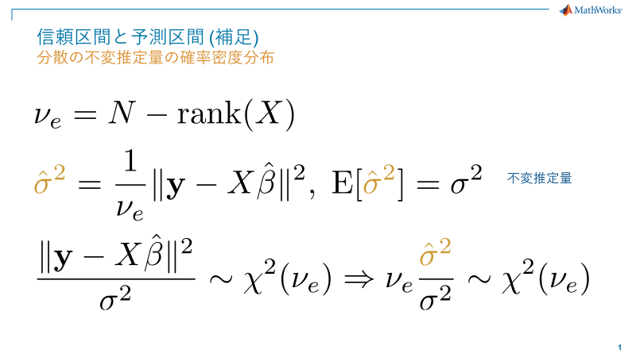

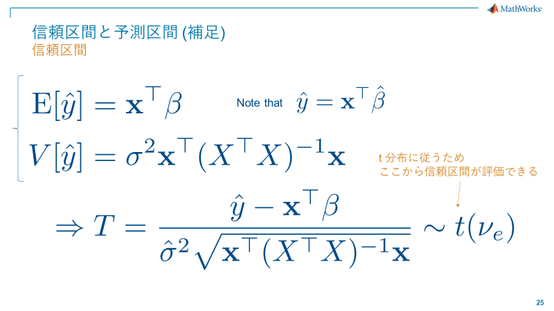

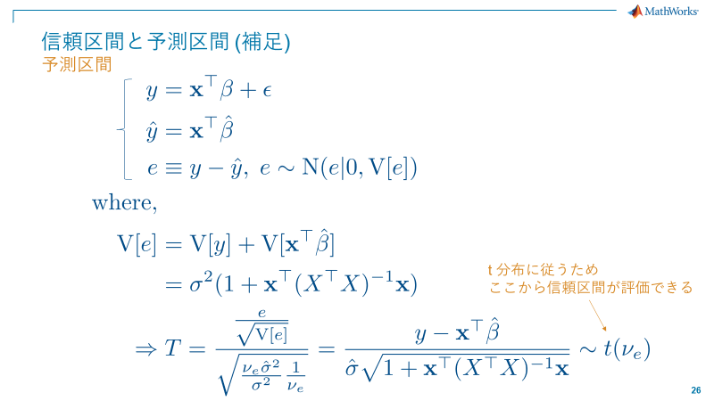

# ポイントまとめ1

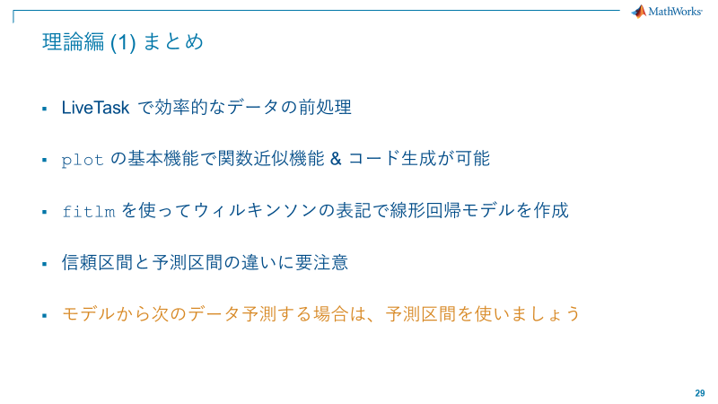

*Copyright 2022 - 2022 The MathWorks, Inc*
